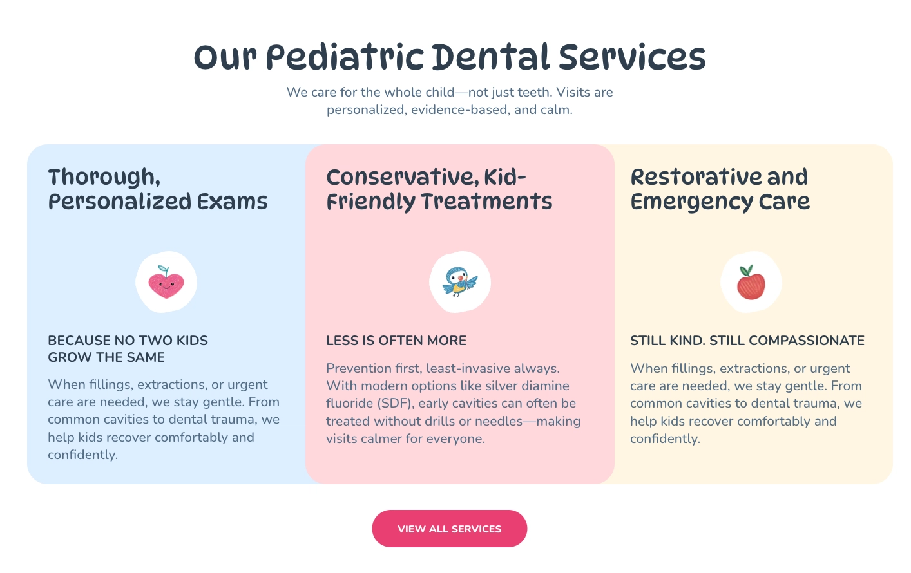
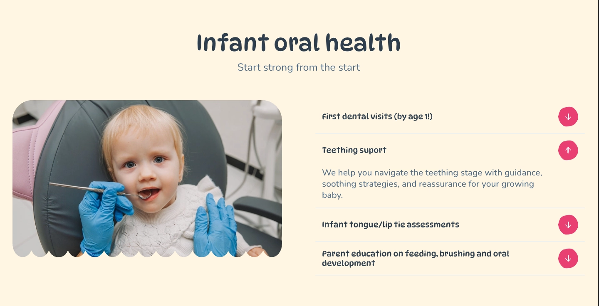
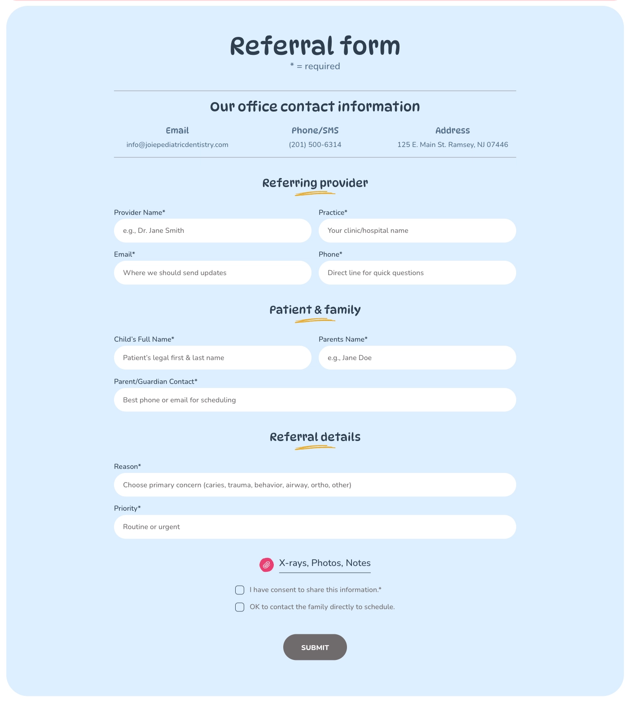
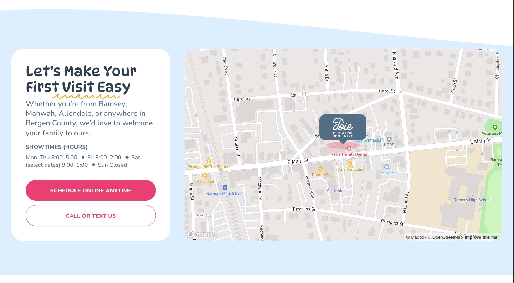

# Joie Pediatric Dentistry


A modern, responsive multi-page website built for a pediatric dental practice in Ramsey, New Jersey.

The project focuses on performance, accessibility, SEO, responsive design, and an intuitive user experience for both parents and healthcare professionals.

## Live Demo

👉 https://joie-multipage.pages.dev

## Project Overview

This project is a multi-page website developed for a pediatric dental practice and includes:

* Home Page
* Meet the Doctor
* For Parents
* For Professionals
* Referral Form
* Contact & Directions

The website includes custom UI components, responsive layouts, interactive forms, Mapbox integration, and optimized media assets.

## Screenshots

### Services Section



### Services Page



### Referral Form



###  Find Us Section



## Technologies Used

### Frontend

* React 19
* TypeScript
* Vite
* Tailwind CSS 4

### Routing

* React Router DOM

### Forms

* React Hook Form

### Maps

* Mapbox GL
* React Map GL

### Performance & UX

* React Intersection Observer
* Lazy Loading
* Image Optimization
* Code Splitting

### Development Tools

* ESLint
* TypeScript ESLint
* Vite React Plugin

## Features

* Fully responsive design
* Mobile-first approach
* Custom reusable UI components
* Interactive referral form
* File upload functionality
* Form validation
* Mapbox integration
* Custom map markers
* Open Graph metadata
* Twitter Card metadata
* Performance optimization
* Cloudflare Pages deployment
* Responsive navigation
* Multi-page architecture

## Environment Variables

Create a `.env` file in the project root:

```env
VITE_MAPBOX_TOKEN=your_mapbox_token_here
```

## Installation

Install dependencies:

```bash
npm install
```

Run development server:

```bash
npm run dev
```

Build project:

```bash
npm run build
```

Preview production build:

```bash
npm run preview
```

## Deployment

The project is deployed using Cloudflare Pages.

## Author

Designed and developed by Tetiana Hrytsenko.
